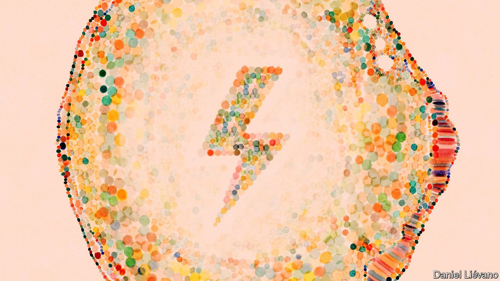
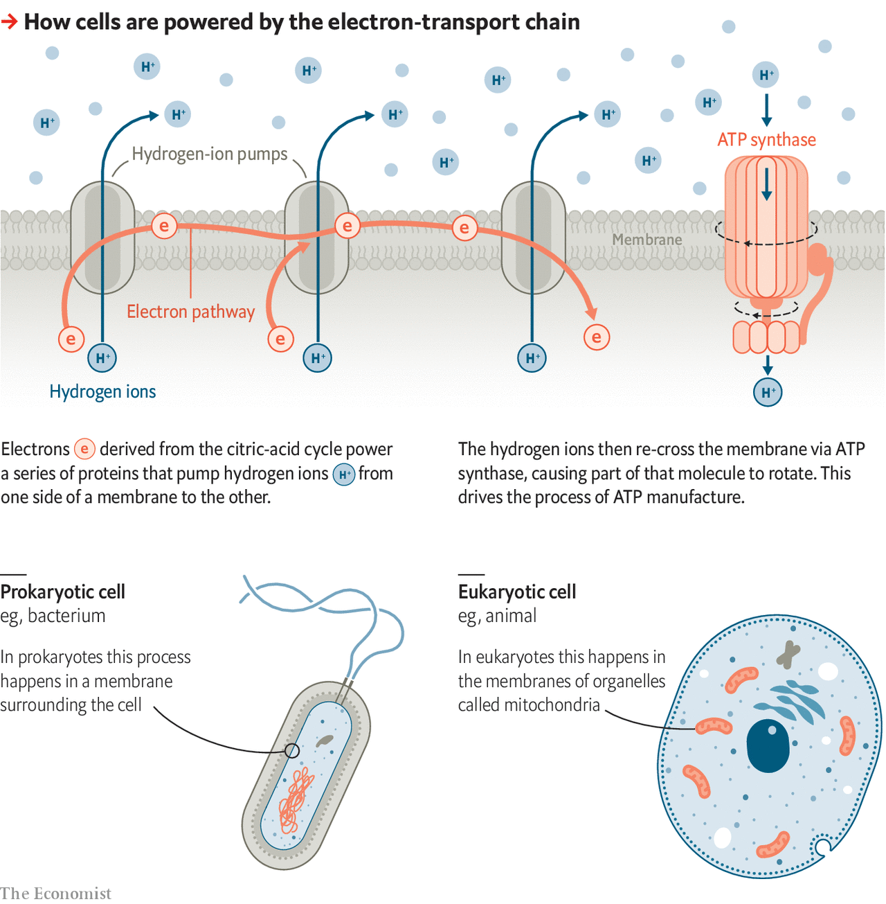

###### Biology brief

# Cells and how to run them 

##### All life is made of cells, and cells depend on membranes 

 

> Aug 5th 2021 

THE CHEMICAL reactions on which life depends need a place to happen. That place is the cell. All the things which biology recognises as indisputably alive are either cells or conglomerations of cells (viruses fall into disputable territory). Since the middle of the 19th century the cell has been seen as the basic unit of life.

A cell requires something to keep its insides in and the outside out. That is the role of the cell membrane, a flexible film made largely of lipids. These are smallish tadpole-shaped molecules with heads that are comfortable in water and twin tails that shun it. When put into a watery solution they naturally form double layers in which the water-tolerant heads are on the outside and the water-wary bits on the inside. Some plant, fungal and bacterial cells employ more rigid structures, called cell walls, as further fortifications beyond their membranes. But it is the membrane which defines the cell.


What is more, the disposition of membranes determines what sort of cell it is. Some creatures use membranes chiefly to define their perimeters. These are called prokaryotes, and come in two varieties, bacteria and archaea. In others they are also used to create structures within cells, notably a nucleus to contain the DNA on which genes are written. Such cells may have ten or 20 times more membrane within them than they have defining their surfaces. They are called eukaryotic, Greek for truly nucleated. Creatures made from them are eukaryotes.

The world’s prokaryotic cells vastly outnumber their eukaryotic cousins. Your own body has roughly as many single-celled prokaryotes living on and inside it (mostly in the gut) as it has eukaryotic cells making up muscles, nerves, bones, blood and so on. Some parts of Earth’s biosphere, such as the ocean floors, contain more or less nothing but prokaryotic life.

But almost everything you have ever looked at and recognised as alive—all the animals, plants, fungi and algae—has been composed of eukaryotic cells. Such cells are typically a lot larger than almost all prokaryotic ones and are capable of a far greater diversity in both form and function. Their versatility is seen in the wide range of shapes they take, from the conjoined starbursts of nerve cells to the creeping mutable blobbiness of amoebae.

Even prokaryotic cells, though, are big compared with the molecules they contain. A bacterium two millionths of a metre long encompasses around 3m protein molecules as well as the DNA which describes them, the RNA necessary to make use of those descriptions and the various smaller molecules that proteins stick together and break apart in the course of their duties (). The membrane of such a bacterium, moreover, contains around 20m lipid molecules.

But if you were to synthesise all the molecules found in that bacterium in a laboratory (quite possible, in theory) and pop them into a bacterium-sized bag you would not get a bacterium. You would get an itsy bitsy mess. A cell is not just a set of contents. It is also a set of processes running alongside each other. The only way to create a cell in which all the necessary processes are up and running is to start off with another such cell in which they are already doing so.

Feed a bacterium with the nutrients it needs and as it grows it will synthesise a copy of the DNA molecule on which its genome is stored. When it is big enough to have made a complete copy of that DNA it will split into two, with one DNA ending up in one cell, and the other in the other.

As it is for bacteria, so it is, mutatis mutandis, for all other life, for ever and ever, amen. Life is made of cells, and cells from pre-existing cells. The 30 trillion cells of which a human body is composed can in almost every case be traced back to the single fertilised egg which started it all (the exception is a condition known as chimerism in which two embryos fuse in the womb early on in development).

Of all the processes that continue from cell to cell as life goes on, none is more fundamental than those which provide life’s energy. These are completely dependent on the membranes in cells. Conditions on the two sides of a membrane will almost always be different; different molecules will be present in different concentrations. The laws of thermodynamics, though, take a dim view of different concentrations of something being next to each other. Small molecules and ions that are more frequent on one side of that membrane than the other will diffuse across it in an attempt to even things up. Proteins embedded in such membranes pump molecules in the opposite direction to maintain the distinction between inside and out.

It is by setting up a gradient of hydrogen ions—hydrogen atoms with their electrons pulled off—across a membrane that living things put energy into a chemical form which they can use. This process depends on sets of proteins called electron-transport chains. These proteins are embedded in the membrane.

Electron-transport-chain proteins pass electrons to each other in a way that causes hydrogen ions on the inside of the membrane to get moved to the outside. The ions thus build up outside, which means that nature’s tendency to even out concentrations requires some of them to get back inside. This they do by means of a magnificent protein called ATP synthase, or just ATPase. Molecules of ATPase provide channels through the membrane which it is easy for the hydrogen ions to flow through. This flow yields usable energy, like the flow of water through a watermill.

 


That is not an idle metaphor. ATPase has several parts, one of which can rotate with respect to the others. As the ions flow through the protein they spin this rotor at a speed of 6,000rpm. If you could hear them at work they would be humming at something like the G two octaves below middle C. Another part of the molecule uses the kinetic energy of this spinning rotor to affix phosphate ions to a molecule called adenosine diphosphate (ADP), thus making adenosine triphosphate, or ATP—cell biology’s near-universal energy carrier.

In almost all instances where a cellular process requires energy, that energy is provided by breaking ATP back down into ADP. Adding an amino acid to a growing protein uses up roughly five ATPs. Synthesising membrane lipids costs about one ATP for every two carbon atoms used. A bacterium doubling in size uses about 10bn ATPs to build all the molecules it needs, meaning every one of the 10m or so ADP molecules the bacterium contains is turned into ATP and broken back down again 1,000 times during the process.

To keep the ATPase whirring, the cell requires a constant flow of electrons along its membrane-bound electron-transfer chains. There are two ways of creating such flows: respiration and photosynthesis.

Respiration breaks molecules of glucose down into carbon dioxide and water through a suite of reactions called the citric-acid cycle. A glucose-molecule’s worth of electrons typically pushes ten hydrogen ions across the membrane in which the respiratory electron-transfer chain is embedded. As they flow back through the ATPase they can generate 20 ATPs.

Photosynthesis uses the energy of sunlight to liberate electrons from water molecules, thus creating oxygen and also hydrogen ions ready for pushing across the membrane. Some of the ATP made this way powers a process that combines those ions with carbon-dioxide. A few more chemical reactions produce a sugar such as glucose, which then goes on to be built into all the other molecules from which life is made. Photosynthesis builds up the world’s biomass; respiration breaks it down.

Once upon a time

In a prokaryotic cell the membrane in which electron-transfer proteins sit is that which surrounds the cell. In eukaryotic cells respiration takes place in intracellular structures—organelles—called mitochondria. These consist of folded-up membranes rich in electron-transport chains. Containing lots of mitochondria (in humans, hundreds or thousands per cell is not uncommon) means such cells can generate a great deal of ATP. If all the membranes in your body’s mitochondria were joined and spread out flat they would cover several football fields.

Under a microscope, some mitochondria look a lot like bacteria. This is not a coincidence, it is a family resemblance. When Earth was a bit more than half its present age, which is to say around 2bn years ago, two prokaryotes, one from the archaea and one from the bacteria, contrived to merge. How, exactly, they did so is far from clear. But that merger created something truly novel: the first eukaryotic cell. Mitochondria are descendants of the bacterium involved, a descent demonstrated incontrovertibly by the fact they still have remnant genomes of their own which are distinctively bacterial. In human beings these little mitochondrial genomes are the only DNA not sequestered on chromosomes in the nucleus.

All the mitochondria in all the eukaryotes in the world date back to that merger. Similarly, chloroplasts—the organelles of photosynthesis found in plants and algae—date back to a later event in which a eukaryote engulfed a photosynthetic bacterium. Many eukaryotes remained single-celled, and do so to this day. But others began forming colonies which permitted division of labour between cells and encouraged the development of specialised body parts called organs. Which are the subject of next week’s Biology brief. ■

