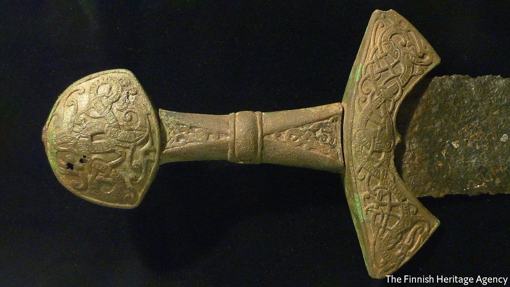

###### A non-binary burial

# An intriguing reinterpretation of an ancient grave 

##### The past is not always what you think it was 

 

> Aug 5th 2021 

IN 1968 A GRAVE dating from about 1100 was uncovered near Hattula, in Finland. Little remained of the occupant’s skeleton, but the inhumation included two swords and a sheathed knife. Such grave goods would normally suggest said occupant was a man. The skeleton was, however, also adorned with brooches and woollen clothing of types more usually worn at the time by women. This led to speculation that the burial was actually of a powerful woman, possibly a local ruler in her own right rather than just the wife of a male monarch.

This would be noteworthy enough. But a re-examination of the remains, just published in the European Journal of Archaeology by Ulla Moilanen of the University of Turku and Elina Salmela of the University of Helsinki, suggests the truth may be yet more intriguing. Ms Moilanen and Dr Salmela suspect that the individual in question may have had outward characteristics of both a man and a woman.


In 1968 working out the sex of a skeleton in an ancient grave was tricky. After years of deterioration, the bones of men and women look pretty-much alike. But that was before the use of DNA became possible. So Ms Moilanen and Dr Salmela thought it worth trying again.

Most people have two sex chromosomes: XX in women and XY in men. Find DNA from a Y-chromosome in a skeleton and the chances are the body in question was male. And, looking at a fragment of femur brought to her by Ms Moilanen, who is the archaeologist in the collaboration, Dr Salmela, who is the geneticist, did indeed find such DNA. But not much of it. That led her to wonder about contamination, but also to consider whether the individual in the grave had had an extra X-chromosome that was swamping the signal from the Y.

Having an anomalous number of sex chromosomes is rare, but not vanishingly so. The particular combination XXY leads to what is known as Klinefelter’s syndrome. People with this karyotype are male, but may have small genitals and reduced body hair. Some also develop breasts, a female secondary sexual characteristic, during puberty.

To determine the occupant’s karyotype from the meagre amount of DNA available, Dr Salmela drew comparisons with living people. The grave yielded 8,329 sequenceable fragments, so she used a computer to draw samples of similar size from the genomes of living people with various karyotypes, including XXY, and also from mixtures of both sexes, to mimic contamination. She then compared these with the DNA from the grave and concluded it was 99.75% probable the individual concerned had indeed had Klinefelter’s syndrome.

While Dr Salmela was working all this out, Ms Moilanen and her team had another look at the grave. They confirmed that it was a high-status burial. For instance, they discovered traces of feathers below the spot where the skull had been, hinting that the deceased individual’s head had rested on a feather pillow. They also found evidence of fine furs, probably from foxes.

Clearly, this was a venerated human being, but what led to that veneration in a world then dominated by masculine values is a matter of speculation. Perhaps the person in question came from a family powerful enough for such things not to matter. But perhaps those who did not fit easily into sexual categories nevertheless had honoured roles in society. Across the Gulf of Bothnia in Sweden a near-contemporary grave found last century contained a man buried in women’s clothes and jewels, but otherwise with masculine grave goods. Stereotyping can work in many ways. And one is to accept, unthinkingly, modern stereotypes about the past. ■

An early version of this article was published online on August 4th 2021

