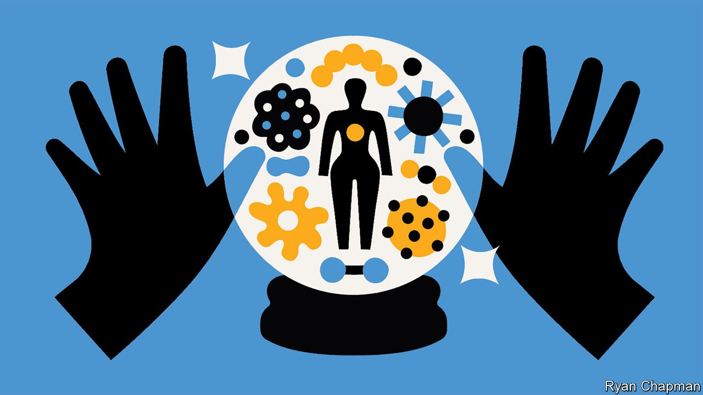

###### Combating future viruses

# Predicting viral evolution may let vaccines be prepared in advance 

##### New techniques could programme people’s immune systems against future pathogens 

 

> Aug 5th 2021 

GENERALLY, IMMUNE systems mount responses only against pathogens that have already infected the bodies they are protecting. Science, though, can shorten the path to immunity by vaccination. This involves presenting the immune system with harmless or lookalike versions of dangerous pathogens so that it may create antibodies and killer cells hostile to the real thing in advance of any actual infection, thereby reducing its danger.

Like immune responses themselves, however, vaccination generally has to wait for the appearance of the pathogen in question before it can do its stuff. There is therefore a delay between a pathogen’s arrival on the scene and the deployment of a vaccine against it. That delay costs lives. Even in the case of covid-19, which has prompted the fastest vaccine-development programme the world has ever witnessed, millions are reckoned to have died by the time vaccinations began to be given in the rich world at the end of 2020.


But, just as vaccination introduces immune systems to pathogens that are remote from them in space, new techniques which have come to the fore during the current pandemic offer the possibility of introducing them to pathogens that are remote from them in time—pathogens, indeed, that have not yet evolved, but which are likely to do so in the future. Thanks to a combination of high-throughput DNA-sequencing technologies and modern machine-learning it is now possible not merely to observe which variants of a virus are circulating, but also to suggest how they are likely to change. Understanding in this way what a virus might look like in the months and years to come gives those designing vaccines and therapies a leg up, enabling them to prime more immune systems sooner, so that fewer people die.

The starting point for these predictions is the sort of work going on in the laboratory of Jesse Bloom, a virologist at the Fred Hutchinson Cancer Research Centre, in Seattle. Dr Bloom and his colleagues grow variants of coronavirus spike protein (the molecule which such viruses use to attach themselves to cells they are about to infect) in Petri dishes. They then scan through these to discern which mutations have what effects.

They have named this technique deep mutational scanning. It uses an array of yeast cells that have been genetically modified to express a part of the spike protein called the receptor-binding domain (RBD). As the yeast cells churn out their RBDs, many emerge, thanks to errors inherent in their production, with slight deviations in their structures from that of the original wild-type virus. Dr Bloom’s team then test the RBDs from each yeast cell to see how tightly they bind to ACE2, a receptor protein found on the surfaces of some human cells, to which the coronavirus attaches itself before entering those cells. RBDs that bind tightly have their underlying genomes sequenced, to determine which mutations are present.

When Dr Bloom’s team ran this scan in the summer of 2020, on spike from a version of the virus then circulating, they spotted a mutation called N501Y which appeared to confer a binding advantage. A few months later, that mutation appeared in the Alpha variant, which for several months was dominant across much of the world. Dr Bloom says it would be “charitable” to say that he and his colleagues had predicted the emergence of N501Y. It was by no means the only mutation of interest to turn up. But even so, having a limited set of such mutations to focus on is useful for narrowing the field of research.

Getting the message across

One firm taking advantage of that narrowing is Flagship Labs 77, a company based in Boston that has until recently been working in secret. FL77, as it is known for short, is a spin out from Flagship Pioneering, a biotechnology incubator run by Noubar Afeyan, a venture capitalist. Moderna, a trailblazer of the messenger- RNA-based technology that helped speed up the production of coronavirus vaccines, was also a Flagship Pioneering company, and Mr Afeyan is its chairman.

FL77’s researchers are trying to combine experimental data of the sort Dr Bloom is collecting with computation, in order to predict how viruses may evolve. That information could be used to develop vaccines and therapeutic antibodies pre-emptively. Whereas Dr Bloom’s laboratory predicts only single mutational hops, FL77 can currently manage five or six. The firm calls its system “Global Pathogen Shield”. The details remain confidential, but in June it published a paper outlining the project’s goals. This described the scale of the challenge involved in keeping pace with viral evolution—namely that biology is so diverse that even looking at a small slice of possible mutations leads to a problem which rapidly grows beyond the plausible limits of observation, to one on the scale of counting and categorising all of the atoms of which Earth is composed.

The conventional response to such overwhelming odds has been observation rather than experimentation. The World Health Organisation’s Global Influenza Surveillance and Response System does this for flu. It monitors which viruses are circulating in the southern hemisphere when it is winter there, in order to focus attention on which strains will be relevant during the next northern-hemisphere winter, and vice versa. During the coronavirus pandemic, organisations such as Nextstrain and GISAID have kept track of variants of SARS-CoV-2 in a similar way.

FL77 aims to take this much further—not only tracking which variants of a virus are where, but also predicting how they will evolve. It does this by feeding into a piece of software called Octavia data from a scaled-up version of Dr Bloom’s deep mutational scanning that runs assays on between 1m and 10m variants.

Octavia’s job is to recognise patterns in the Petri-dish data—for example, which of the millions of mutations tend to lead to tighter binding, and also which lead to poorer neutralisation by antibodies—and then to extrapolate those across all possible variants of spike. This leads to predictions about which mutations will defeat antibodies, and which will spread more easily. That, says the paper, “makes it possible to define a protective antibody repertoire”, whether through vaccination or manufacturing of antibody proteins themselves. FL77 calls this an “antibody net”.

Dr Bloom, who is advising FL77, and who holds patents on deep mutational scanning, says the value of these kinds of predictions has become clear with the development of messenger-RNA vaccines. These are not just quick to make, but quick to update. Their manufacturing process starts with the gene for the viral protein that the immune system is desired to attack, and ends with a strand of RNA which encodes that specific protein.

In covid-19 vaccines, the protein in question is spike. Updating vaccines to take account of predicted variants of spike is merely a matter of inserting the relevant genetic code at the start of the manufacturing process. At the least, such predictions would permit a library of candidate vaccines to be held ready, in anticipation of rapid manufacturing. At its most ambitious, FL77 imagines vaccinating people against variants of a pathogen that are not yet circulating, but are likely to.

Deep mutational scanning may have other uses, too. Gabriel Victora, an immunologist at Rockefeller University in New York, thinks predicting the evolution of a pathogen in this way will be useful not just for designing antibodies and vaccines, but also for detecting parts of the virus which change only rarely, and aiming antibodies at what would thus be reliable targets.

 


This, though, is difficult. The shape of any given segment of a protein depends on the rest of the molecule of which it is a part. Yet, for the immune system, the shape of its target is a crucial feature that it needs to learn in order to recognise its foe. So, though predictive approaches like FL77’s might spot segments of viral proteins which are unlikely to change, getting the immune system to look at them specifically is difficult, because expressing an isolated protein segment in a way that makes it the same shape as it is when it is part of a bigger structure is tricky.

A more brute-force approach is simply to show the immune system all of the protein structures that are likely to emerge in future, so that it makes antibodies against the lot. Dr Victora says that immune systems have no known limit to their capacity to absorb information about pathogens. Instead, the problem with this approach may come if the system preferentially makes antibodies to some of the predicted variant proteins, but not others.

Strain gauge

Seasonal flu vaccines already grapple with this problem when updating immune systems with information about the strain predicted to be circulating in the coming winter. Even after vaccination, immune systems may tend to make antibodies against the old virus instead. It is not clear whether the same thing will happen with updated messenger-RNA vaccines.

No programme will ever be able to predict the evolution of the entire array of pathogens which can plausibly infect human beings. But for those already known to pose a threat, systems like Octavia may be able to see far enough into the future to offer benefits. “We don’t have to be able to predict arbitrarily,” says Dr Bloom. “We don’t need to predict mutation in a decade. Just a radius of five to six mutations from where we are now. That’s good enough.”

FL77 is already doing this. The most radical version of the firm’s vision—vaccinating against variants and strains of pathogens that are yet to emerge—is some way off, if it ever happens. Protecting people by programming their immune systems against future pathogens, not just those already circulating, would be a fundamental shift in the meaning, purpose and ethics of vaccination. But even in the absence of that, pathogen prediction should soon serve to speed existing sorts of vaccination programmes. And every increase in the speed of vaccine development means thousands of saved lives. ■

Dig deeper

All our stories relating to the pandemic and the vaccines can be found on our . You can also find trackers showing ,  and the virus’s spread across  and .

An early version of this article was published online on August 4th 2021

