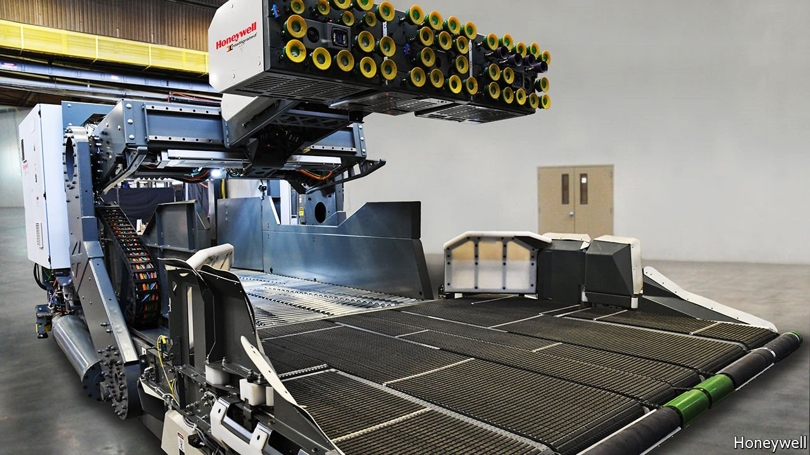

###### Automatic goods handling

# Robots are poised to start unloading lorries 

##### The last pieces of warehouse automation will soon be in place 

 

> Aug 5th 2021 

UNLOADING LORRIES is wearisome for people, but hardly an intellectual challenge. For robots it is the reverse. Robots never tire. They do, however, have problems interpreting the data streaming in from the cameras and laser scanners that are their eyes. Seeing where one box in the back of a crowded lorry ends and another begins is second nature to a human being. But even the best artificial-vision systems struggle to cope.

And that is just the start. The next question is what the robot should do with what it sees. The less tidy the contents, the greater the problem. Shrink-wrapped pallets of packages are one thing, the miscellaneous jumbles of objects handled by parcel-delivery businesses quite another. Cases may get wedged, or be fumbled. Or the robot may need to work out how to lift an irregular consignment like a set of skis. People learn how to do such things gradually, as they grow up. And machines have to learn, too. That takes time and a lot of training.


Unloading lorries is therefore one of the few parts of operating a warehouse that has resisted automation. But not for much longer. A new generation of cargo-handling robots is poised to take on the task.

A lorry-load of ideas

The robotics division of Honeywell, a large American technology company, has come up with a vehicle-sized unit (see picture) that fits onto the back of a lorry. It has a large arm fitted with suction cups which can pick up several boxes at a time and then feed them onto a conveyor belt, or knock down a wall of boxes and sweep them onto the conveyor. An individual human worker can unload between 600 and 1,200 boxes an hour. Honeywell hopes that, once its robot is perfected, a single crew chief will be able to supervise the simultaneous unloading of three or four lorries, each at rates of up to 1,500 boxes an hour.

Thomas Evans, chief technology officer of Honeywell’s robotics operation, says the robot does not need to be as precise as the pick-and-place robots that work on assembly lines. But it is still a challenge for it to distinguish between individual boxes and to recognise and identify anomalous objects such as loose pallets and the pallet jacks used to move stacked pallets around. At the moment, therefore, it works best with boxes of uniform size and shape.

Changing that will need a lot of training, which, in turn, means designing and assembling a variety of dummy loads inside a variety of vehicles. This is both time-consuming and labour-intensive. Dr Evans says his team can put together about four such test loads a day. Ideally, that number would be nearer 100—but running tests at this scale would be expensive. Digital simulations can help. They are, though, Dr Evans says, no substitute for the real thing. He is therefore negotiating with one of the potential customers for the robot, a company that already handles this volume of business, to do the training there.

In Massachusetts, a firm called Boston Dynamics takes a different approach from Honeywell’s. Boston Dynamics is famous in the wider world for an acrobatic humanoid robot called Atlas, and for Spot, a robot that resembles a dog and is now on sale as a device for monitoring what is happening in factories and other large spaces. The firm’s good-handling system, Stretch, is, however, the first it has custom-built for a particular task.

Stretch is smaller and more mobile than Honeywell’s robot, and is able, according to Kevin Blankespoor, Boston Dynamics’ general manager of warehouse robotics, to move easily from one lorry to another, or to a different part of a site altogether. It sports a single arm festooned with sensors and a suction gripper able to handle boxes weighing up to about 25kg. Unlike Honeywell’s system, Stretch can already manage the trick of examining a wall of boxes, working out their sizes and shapes, and choosing which to pick up first. It is, though, slower. The aim is that it will be able to handle 800 cases an hour.

A third contender, Dill, is made by the Pickle Robot Company, also based in Massachusetts. Andrew Meyer, Pickle’s boss, believes Dill has an edge over the competition because Pickle’s engineers have focused on the robot’s ability to handle messy trailers with irregular loads. This is not just a matter of machine vision and an ability to work out where boxes are, but also of understanding the laws of physics, and therefore how particular objects will behave. That helps Dill decide which is the best box to pick up next, and how to deal with it as speedily as possible without dropping it.

Keep on trucking

In particular, Dill is designed for what Mr Meyer terms “centaur operation”, in which human and robot collaborate, rather than the human’s role being merely supervisory. Dill is skilled at spotting problems it cannot deal with and then calling in human assistance. It can handle 98% of cases on its own, Mr Meyer claims—though it has problems with things like damaged goods and unexpected objects. The upshot is an arrangement which, he says, has a maximum capacity of 1,600 packages an hour, with a realistic average of 1,000.

The next task, which all three companies are now engaged in, is to run the unloading process in reverse by using robots to load lorries in the first place. Besides simply lugging boxes around, this also involves working out how to stack them efficiently. Solving that problem, and doing so at the speed which commerce requires, would allow warehouses to be almost completely automated. The firm that perfects this trick may not be popular with unions. But managers will love it. ■

An early version of this article was published online on August 4th 2021

