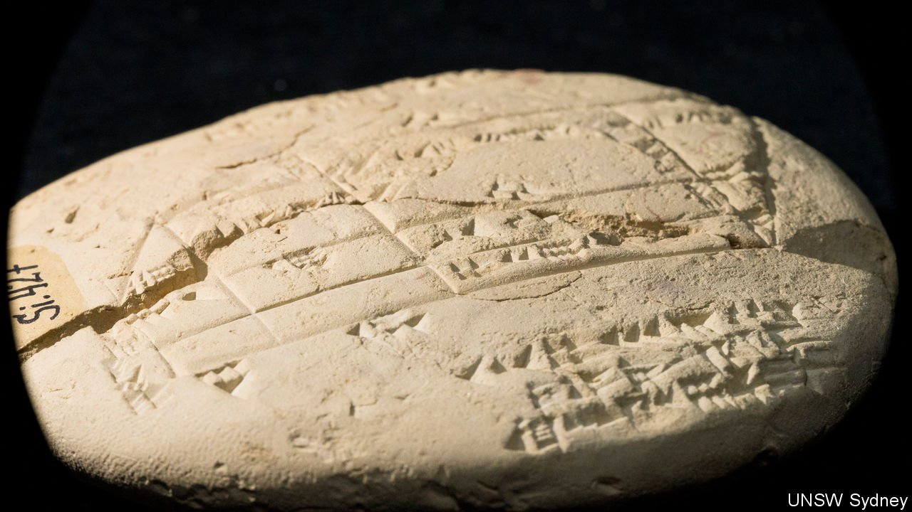

###### Ancient geometry

# The Babylonians used Pythagorean ideas long before Pythagoras 

##### Surveyors employed them to measure out land 

 

> Aug 5th 2021 

MOST READERS will have encountered Pythagoras’s theorem about right-angled triangles—that the square on the hypotenuse is equal to the sum of the squares on the other two sides—at school. But the less-mathematically inclined might have been tempted to ask when such knowledge would ever be useful in real life. One answer, predating Pythagoras by over 1,000 years, is in land surveying.

Lurking in a museum in Istanbul is a 3,700-year-old clay tablet known as Si.427. It has been there since it was dug up in the 19th century in Sippar, an ancient Babylonian city in what is now Iraq. Only this year, however, has its significance been revealed—by Daniel Mansfield, a mathematician at the University of New South Wales, in Australia. As he describes in Foundations of Science, Dr Mansfield has shown that Si.427 is inscribed with the world’s oldest known example of applied geometry.


Si.427 seems to have been created by a surveyor defining land boundaries after part of a field was sold. This is, of itself, unremarkable. What is remarkable is that its text describes the use of what are now called Pythagorean triples to draw accurate right angles.

Pythagorean triples are special cases of Pythagoras’s theorem. They are sets of whole numbers that correspond to the lengths of the sides of particular right-angled triangles. Three, four and five for example, or five, 12 and 13. Another tablet, Plimpton 322, showed many decades ago that the Babylonians knew about these triples. What researchers could not agree on was why they were interested.

Dr Mansfield’s answer is surveying, for this was a period when agriculture was developing, and with it the idea of land ownership. One way to measure the size of a field is to divide it into rectangles and right-angled triangles, both of which have easily calculated areas. Knowing Pythagorean triples makes drawing the right angles needed to construct these figures easier, and so is useful information. QED.

An early version of this article was published online on August 4th 2021

