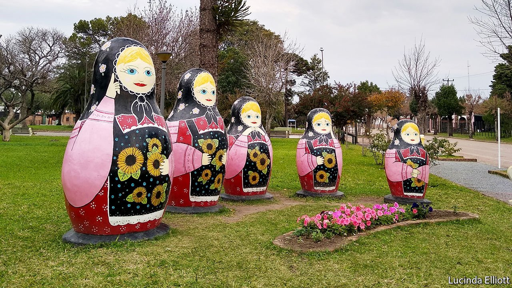

###### You say pirozhki, I say empanada

# In Uruguay few descendants of Russian émigrés want to leave 

##### Despite Vladimir Putin’s encouragement for them to move back 

 

> Aug 5th 2021 

NEAR THE banks of the River Uruguay, Tatyana Bochkariov, a mother of six, wears a colourful talichka, a type of dress typical in 19th-century Russia. Her eight-year-old son Pavel climbs an orange tree in front of the family home and calls out to his mother in Russian, his first language. Only a few trappings of modernity—their fleece jackets, gas-powered heating and Pavel’s toys—distinguish the family from the Russian peasants who came to Uruguay a hundred years ago.

The Bochkariovs live on the outskirts of San Javier, a town of 1,700 people on the border with Argentina. It has been a “Russian colony” since 1913 when 300 families moved there in search of religious freedom. Pastries sold in bakeries there, looking much like any other South American empanada, are billed as pirozhki. Russian is used on street signs alongside Spanish.


Although many Russian-Uruguayans were persecuted under the military dictatorship of 1973-85, as they were suspected of being communists, they are now free to speak Russian, wear traditional clothes and practise their religion. Near San Javier is a community of Old Believers, an austere Russian Orthodox sect that protested against church reforms in the 17th century.

Such old-fashioned piety has piqued interest back in Russia. In 2006 Vladimir Putin, Russia’s president, started a programme which would pay those with Russian heritage to move back. In 2019 the Russian media announced that eight Old Believers living in Brazil and the United States had become naturalised Russian citizens. Around 3,000 “compatriots” worldwide had applied for resettlement in the first nine months of 2019.

In San Javier few seem to have taken up the offer. Last year six visas were issued to Uruguayans, compared with nine in 2019. Leo Lorduguin, a 21-year-old, hardly knows of anyone who has moved. He is proud of his Russian heritage, but is also happy to be Uruguayan, pointing to the country’s security and democracy. “I like that a man of Russian descent can prepare an excellent asa do [barbecue] in just the same way as someone who has no ties to Russia can finely grill shashlik [kebabs],” he says. “In Uruguay both are respected and these cultural exchanges are encouraged.”

