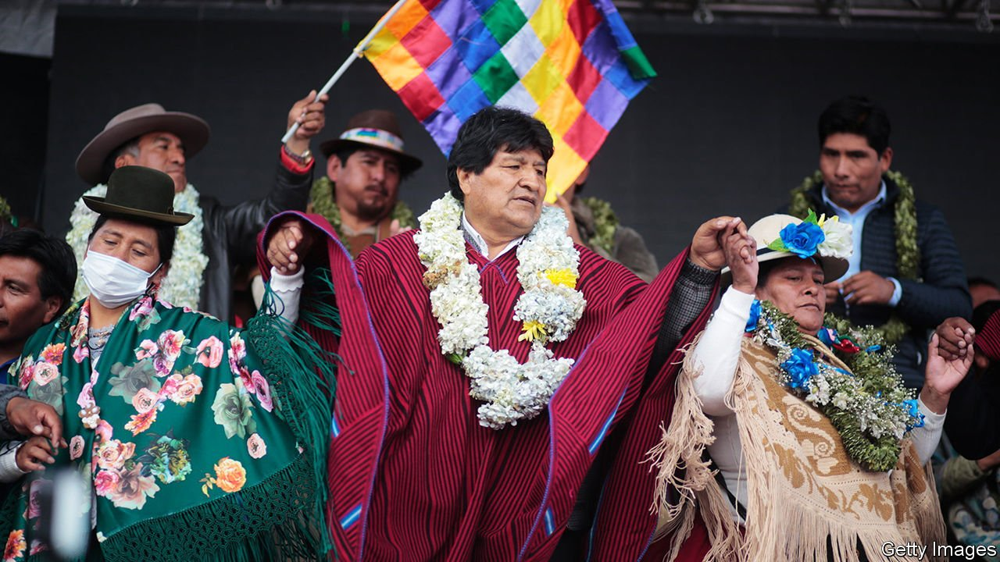

###### Bolivia’s woes continue

# Is Evo Morales staging a comeback in Bolivia? 

##### The leftist former president could be helped by a quarrel over who is to blame for protests in 2019 

 

> Aug 7th 2021 

AT A CRAFT fair in a rich neighbourhood of La Paz, Bolivia’s administrative capital, Paula Maceda, a 22-year-old selling home-made rucksacks, sighs as the topic of the government comes up. “We are sick of politics,” she says. “We want jobs, vaccines, food.” In 2019 she was at university when signs of fraud in an election apparently won by the leftist president, Evo Morales, led to weeks of protests. After the police and army withdrew their support, Mr Morales resigned and fled to Mexico. In El Alto, a poor city of 1m people on the frigid plain above La Paz, Ms Maceda’s family shut themselves indoors as pro-Morales mobs torched police stations. Across Bolivia 36 people were killed. In the final days of 2019 her class debated the crisis: “Some of us thought there had been fraud, others thought it was a coup.”

Nearly two years later, the quarrel about what happened still dominates Bolivian politics. In March the government of Luis Arce, a former finance minister under Mr Morales and the winner of a new election last year, jailed his predecessor, the right-wing interim president, Jeanine Áñez, on charges of having carried out a coup.


Further unrest looms. On July 28th the attorney-general announced that he would end an investigation into the alleged fraud. Opposition groups in La Paz and Santa Cruz, a city brought to a standstill by the earlier protests, called for new demonstrations in the first week of August, as The Economist went to press. Following Mr Arce’s election, Mr Morales returned to Bolivia late last year, and appears to be keen to get back into politics.

Despite all the talk of fraud or coup, what occurred in 2019 was hardly clear-cut. After a 24-hour pause in the rapid count of votes sparked the first protests, audits by the Organisation of American States (OAS) and the European Union (EU) found grave irregularities, such as a hidden server used to send tally sheets that was not reported to electoral authorities. Following Mr Morales’s forced resignation, the vice-president and heads of Congress also resigned, which led to a power vacuum. In talks mediated by the Catholic Church and the EU, opposition leaders and some legislators from Mr Morales’s Movement to Socialism (MAS) decided that Ms Áñez, the second vice-president of the senate and the next in line according to the constitution, would fill it. Later that day, however, the legislators refused to swear her in. More protests erupted, this time against Ms Áñez.

MAS leaders now accuse the opposition, the OAS and half a dozen foreign ambassadors of conspiring to spark a civilian uprising to oust Mr Morales. The attorney-general confirmed many of the irregularities found by the OAS but concluded they were due to “negligence”, not fraud. The opposition denies taking part in a coup. It argues that the origins of the uprising and the rupture of democracy lay not in 2019 but in 2016, when Mr Morales ignored constitutional term limits and a referendum in which 51% of Bolivians said he should not be allowed to run again.

Since 2019 such rows have been routine. Under Ms Áñez, the attorney-general’s office rushed to open cases against Mr Morales for fraud, corruption, terrorism and sedition. The same office closed most of them as soon as Mr Arce won and filed cases against 60 officials from Ms Áñez’s government. Human Rights Watch, an international monitor, says both sides have resorted to “revenge justice”. Even Mr Arce’s justice minister, Iván Lima, calls prosecutors’ timeline “imprecise” and the crimes of which Ms Áñez is accused (terrorism and sedition) “unconstitutional”.

Part of the problem is that the line between the executive and judicial branches has long been blurry. In 2011 Bolivia began to elect judges by popular vote. Although the move was presented as a way to democratise the courts, it facilitated political control instead. Candidates are selected by the MAS-dominated Congress, which prizes loyalty over experience. Short mandates (two to six years) also make judges vulnerable to pressure. Well over half are interim nominees who can be kicked out at any time. “There is a problem with judges’ independence,” Mr Lima admits.

A plan for judicial reform was set aside earlier this year as the MAS focused on the coup case. According to Jorge Richter, Mr Arce’s spokesman, this case is needed to restore democracy. The government is “unwilling to turn the page on impunity”, he says, adding that the MAS’s return to politics will also restore prosperity, by reintroducing an economic model the “coup” thwarted: public investment, import substitution and wealth redistribution.

But for many economists this model is woefully outdated. Growth has been slowing since 2014 when commodity prices fell and the MAS began dipping into foreign reserves to fund spending. Reserves are down to $4.7bn (12% of GDP) from a peak of $15bn in 2014. Although cheques to the poor, low-interest loans to businesses and cash to state firms are expected to push growth to 5% this year, Bolivia will struggle to service its debts. The pandemic caused the mostly informal economy to shrink by 9% last year.

The MAS’s obsessive focus on talking about a coup could help rehabilitate Mr Morales. So could its strategy of blaming Ms Áñez for the covid-19 crisis, even though she inherited a creaking health system from Mr Morales. Three-fifths of people think Mr Arce is doing a good or average job and more than half expect their livelihoods to improve soon. According to Mr Richter, Mr Arce occasionally meets Mr Morales in order to “assess threats from political enemies”.

To critics this sounds like an attempt to stifle the opposition. “They recovered power and vowed never to give it up again,” says María Teresa Zegada, a sociologist. In the final hours of the outgoing Congress, MAS legislators changed the rules so that many nominations, including that of the head of the police, no longer need a two-thirds majority. Cecilia Requena, a senator from Comunidad Ciudadana, the largest opposition party, says that her party is not told what will be discussed in each legislative session. Congress is merely a funnel for Mr Arce’s orders, she claims.

But the MAS is not as unified as it would like people to think. The coup narrative “masks an enormous frustration” about cronyism, corruption and unfulfilled social promises under Mr Morales, argues Magali Vianca, a lawyer who worked in several MAS administrations before leaving the party. After losing its two-thirds majority in Congress last year for the first time since 2009, the MAS also lost ground in regional elections in March.

Although 75% of people in El Alto voted for Mr Arce last October, the mayoral candidate backed by Mr Morales got just 20% of the vote. The winner was Eva Copa, a 34-year-old former MAS senator. In her earlier role Ms Copa negotiated with Ms Áñez; photos of the senator and the interim president fuelled hope for reconciliation in Bolivian politics. It was fleeting. In December the MAS accused Ms Copa of aiding the “coup” and forced her out of the party.

How Ms Copa manages as mayor (in a fortress-like office, built after protesters razed the previous two) will be a test for left-wing alternatives to the MAS. So far, she says, she is squeezed “in the middle like a sandwich”. The same goes for many people in El Alto. Relatives of the protesters who were killed in the chaos after Ms Áñez took office, possibly by soldiers she sent in, complain that the MAS is using their deaths as a “political flag”.

Many people no longer care whether what occurred in 2019 was fraud or a coup. Ms Maceda says she is too busy trying to earn enough to feed her siblings. As for Mr Morales, people will protest if he tries to run for president again, she thinks. “We won’t trip over the same stone twice.”■

