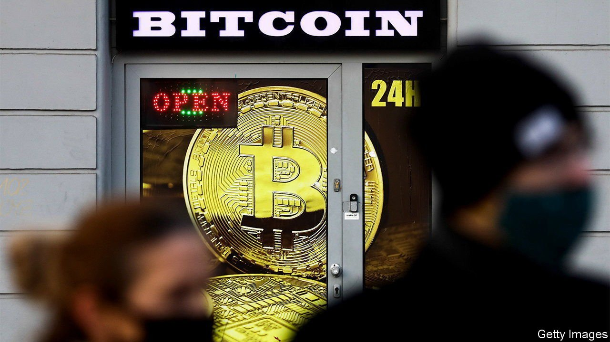

###### 

# Business this week 

#####  

 

> Aug 7th 2021 

Gary Gensler, the chairman of America’s Securities and Exchange Commission, called for more protections for investors in the , which he described as a Wild West rife with fraud and swindlers. Mr Gensler wants federal securities laws to apply to digital currencies and more powers for the SEC to oversee the market. If not, he worries that “a lot of people will be hurt” by bad investments.

Another challenge to traditional banking is emerging from “buy now, pay later” (BNPL), which enables shoppers to spread their payments for goods, sometimes with no interest or credit check but a fee for late instalments. Square, a payments firm run by Jack Dorsey, has offered to buy Afterpay, based in Melbourne and a global pioneer in BNPL, for $29bn, Australia’s biggest-ever takeover. Regulators have expressed concern about BNPL’s lax lending rules. The industry has ballooned during the pandemic. Apple is said to want to enter the market.


The meme machine

Robinhood’s stock had a rollercoaster ride after the firm floated on the stockmarket. The share-trading app had a terrible IPO, with its share price closing 8% down. A few days later the multitude of small investors who favour the app, especially to buy and sell “meme” equities, rushed to buy share options. The frenzied trading pushed the stock up by 85% over the offer price.

General Motors reported net income of $2.8bn for the second quarter and raised its profit forecast for the year. The carmaker was boosted by its lending business. GM Financial benefited from accelerated demand for used cars as . GM kept up production of its bestselling models by diverting chip supplies from its less-popular ones, but warned the shortage could affect future profits.

The proposed $40bn takeover of Arm, a chip designer based in Britain, by , America’s most valuable semiconductor manufacturer, was reported to be in trouble. The British government is said to be worried about the national-security implications, though no decision on scrapping the deal has been taken.

The euro zone’s GDP grew by 2% in the second quarter compared with the previous three months, a better showing than America and China, which grew by 1.6% and 1.3% on that measure. Germany’s economy expanded by 1.5% and France’s by 0.9%.

Big energy companies reported bumper quarterly profits, boosted by the higher price of oil, still their main source of income despite the industry’s move to cleaner fuels. ExxonMobil, which recorded a loss in every quarter last year, made a net profit of $4.7bn.

PepsiCo agreed to sell a majority stake in its Tropicana and Naked fruit juice brands to a private-equity firm for $3.3bn. Although packed with vitamins, fruit juices also have a high sugar content; Pepsi wants to focus on zero-calorie and healthier energy drinks.

Taming the dragon


Tencent was forced to bring in new restrictions on the amount of time that children can play its video games following a backlash from Chinese state media. The Chinese internet conglomerate said that the authorities had told gaming companies to live up to their social responsibilities, adding more pressure on tech firms in China as the government confronts the industry’s growing clout. Tencent’s share price fell sharply. A measure of Chinese tech stocks listed in New York, the Golden Dragon index, has had its worst month since the global financial crisis of 2007-09.

An early target of China’s regulatory crackdown, Alibaba, reported a 34% rise in revenue for the second quarter, year on year. Profit was down, however, as the group spent cash on rejigging its various digital platforms. Like others in the Chinese tech industry Alibaba is also adapting to the government’s new edicts. It will “respond positively with actions”, said Daniel Zhang, the chief executive.

More companies in America announced that they will require staff to be vaccinated against covid-19, a policy that was first adopted by big banks but is spreading across all industries. Following similar moves recently from Google and Facebook, Microsoft will now ask all employees and guests to show proof of a jab, (and will not re-open its offices fully until October), as will Walmart, Disney and Tyson Foods, a meat supplier. Netflix wants the actors and crew on its film sets to be inoculated.

Zoom reportedly agreed to pay $85m to settle a class-action lawsuit that accuses it of sharing customers’ data with third parties, including Facebook and Google. Part of the settlement requires the video- conferencing company to take extra steps to prevent Zoombombing, where hackers crash a meeting to display pornography, racist imagery and other items that are definitely not on the agenda.

