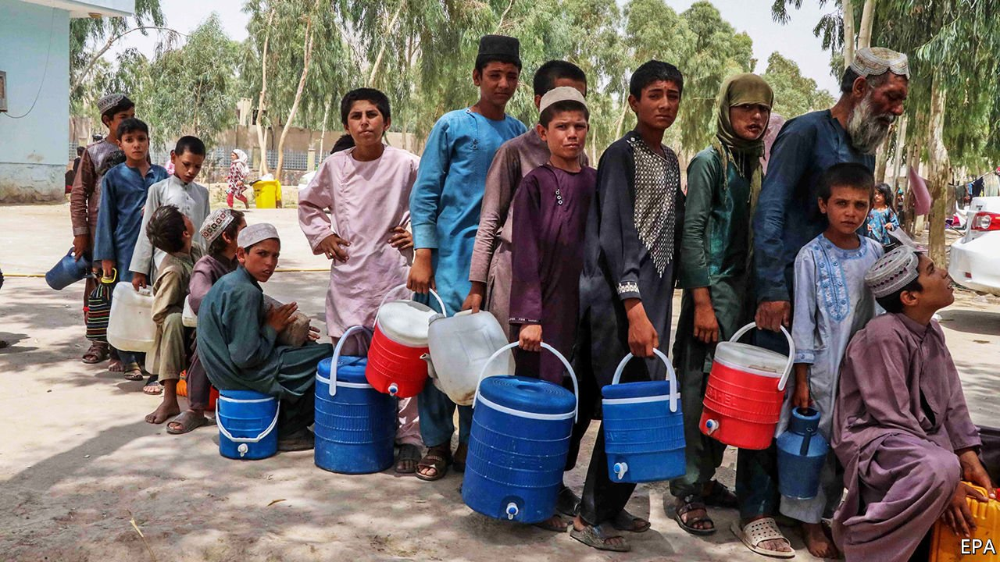
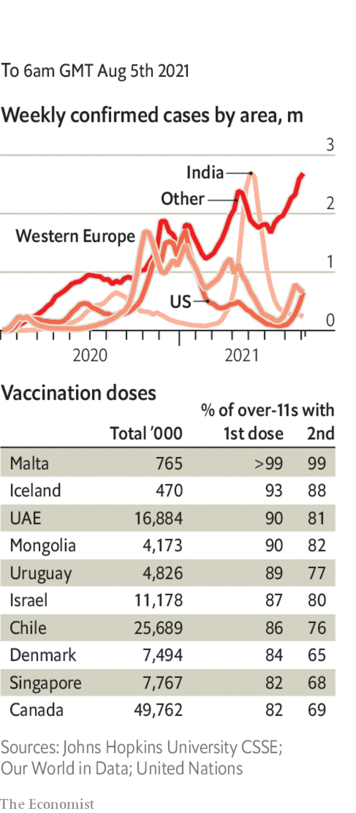

###### 

# Politics this week 

#####  

 

> Aug 7th 2021 

The Taliban intensified their assault on Afghanistan’s cities, with fighting raging in Herat, the country’s third-largest, Lashkar Gah, the capital of Helmand province, and Kandahar. The Taliban also claimed responsibility for a bomb attack at the home of the defence minister in Kabul. The jihadists have been emboldened by the imminent withdrawal of American forces from the country.

Muhyiddin Yassin, , lost his majority in Parliament when 11 lawmakers from a coalition partner withdrew their support. Mr Muhyiddin has clung on to power despite a slim majority by forestalling a vote of confidence. He has promised to reconvene Parliament in September and face a no-confidence motion then.


Covid-19 continued to rage across South-East Asia. Indonesia crossed 100,000 recorded total deaths from the virus. Daily infections in Thailand and Malaysia are hitting new highs and cases in the Philippines are once again sharply on the rise.

Officials in China said the country’s recent increase in covid-19 infections could be traced to a Russian airliner that landed in Nanjing. Travel to and from Beijing has been curtailed. All 11m residents of Wuhan, the city where covid-19 was first identified, are to be tested again.

The recent flooding in China’s central Henan province killed at least 302 people with another 50 missing, according to the mayor of Zhengzhou, where most of the deaths occurred.

In Hong Kong the authorities charged Anthony Wong, a pop star, with corruption for singing at a pro-democracy rally in 2018. Mr Wong fronts a band that has been blocked from streaming sites in China because of the political themes of its songs. He was charged along with a candidate to the Legislative Council for providing entertainment with the intent to sway people’s votes.

Laurel Hubbard became the first openly transgender athlete to compete in a solo Olympic sport. The New Zealander was eliminated from her weightlifting event after failing three lifts.

 came under pressure to resign as governor of New York after the state’s attorney-general released a report into allegations of sexual misconduct, and concluded that he had harassed 11 women. Mr Cuomo denies that his actions were inappropriate. Joe Biden was among the many Democrats who called on him to step down.

, a hardline cleric, was inaugurated as president of Iran. He took office amid allegations that Iran was behind two attacks on international shipping. A drone laden with explosives hit an oil tanker managed by an Israeli-owned firm off the coast of Oman, killing two people. Days later, gunmen boarded a bitumen tanker owned by a firm in Dubai, allegedly redirecting it towards Iran before leaving the vessel.

 deployed the army ahead of a general election. The ruling party has attempted to buy off or bully voters in a bid to defeat Hakainde Hichilema, an opposition candidate who could possibly win if the election were fair. It will not be.

Pedro Castillo, the new left-wing president of Peru, appointed Guido Bellido, a political novice, as prime minister. Mr Bellido is under investigation for an alleged “apology” for the Shining Path rebels and has been criticised for making homophobic and sexist social-media posts. Pedro Francke, a leftist economist, was appointed finance minister.

Brazil’s highest electoral court opened an inquiry into Jair Bolsonaro’s statements about elections in 2022. The president has repeatedly claimed, without any evidence, that there will be fraud in the electronic voting system.

Mexico launched a lawsuit against American gunmakers for their alleged complicity in allowing weapons to cross the border illegally. The suit, lodged in a court in Boston, claims the companies do little to stop their guns falling into the hands of drug cartels.

A Belarusian sprinter at the Olympics sought help from the Japanese police after her coaches tried to send her home when she criticised them. Poland offered Krystina Timanovskaya asylum. In Ukraine, Vitaly Shishov, a Belarusian activist who helped people flee the repressive regime in his homeland, was found hanged in a park. In  two opposition activists went on trial in a closed courtroom.

Firefighters battled to tackle the worst  for decades, which have killed at least eight people. The biggest blazes were in regions packed with seaside resorts.

Prosecutors in Germany said that the trial of a 100-year-old former guard at Sachsenhausen Nazi concentration  camp would go ahead in October. The unnamed man is accused of taking part in the murder of more than 3,500 people at the camp.

More than 200,000 protesters marched in Paris and other French cities against a government edict compelling people to show a covid pass before boarding trains and planes and entering restaurants and cafés. It was the biggest demonstration against the new law so far.

Coronavirus briefs

 


The WHO made a plea to rich countries to delay giving out booster shots of vaccines until the end of September so that supplies can be diverted to poorer countries, where the vast majority of people have not been inoculated.

New York became the first city in America to require proof of vaccination for customers entering restaurants, gyms and other indoor venues. Enforcement will begin on September 13th.

More cities in America, including Atlanta, Los Angeles and Washington, DC, reintroduced rules either requiring or recommending that people wear masks in public indoor spaces. Louisiana said that everyone over five, regardless of vaccination status, should wear one in public. Florida’s governor, Ron DeSantis, rejected a mask mandate. Hospitalisations from the disease and new cases are at their highest in the state since the start of the pandemic.

