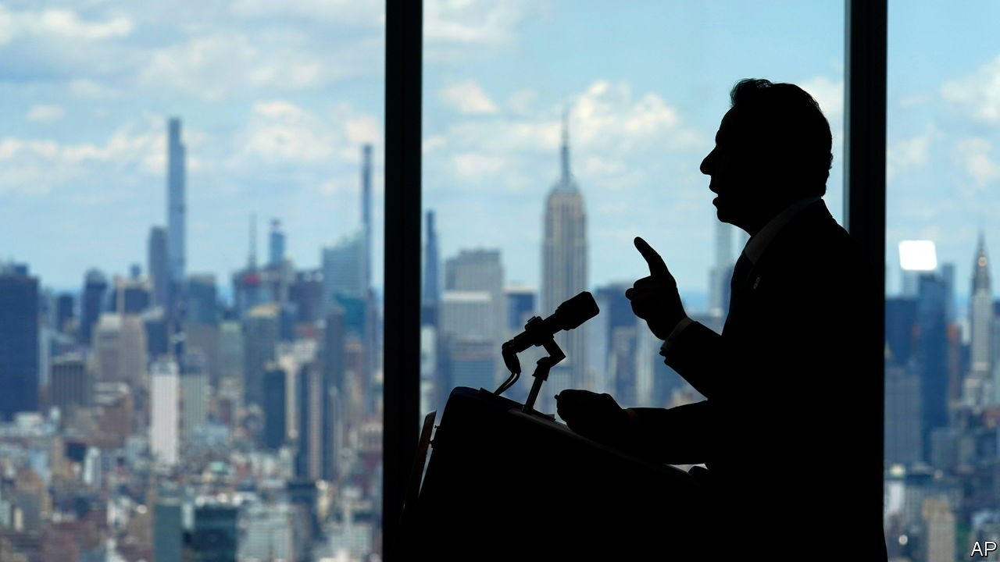

###### Fall from grace

# Findings of sexual harassment put Andrew Cuomo in jeopardy 

##### The governor of New York faces calls to resign and possible impeachment 

 

> Aug 5th 2021 

“I BELIEVE WOMEN, and I believe these 11 women,” Letitia James, New York’s attorney-general, said on August 3rd as she unveiled her much-anticipated report into the many accusations of sexual harassment against Andrew Cuomo, the state’s governor. At 165 pages, it substantiated the claims in devastating detail and concluded that Mr Cuomo and his top aides created a “toxic” workplace that enabled him to mistreat women. Lionised a year ago for his handling of the covid-19 pandemic, Mr Cuomo now finds his reputation in tatters and his career in grave jeopardy.

Among Mr Cuomo’s 11 accusers were past and present staffers as well as a state trooper whom he handpicked for his security detail. One former employee told investigators that Mr Cuomo made women feel like “prey”. He touched them inappropriately, groping and kissing them, and made grossly improper comments, the report concluded.


After the report was released, politicians from President Joe Biden to longtime allies of Mr Cuomo in Albany, the state capital, called on the governor to resign. Ms James said he had violated state and federal law. New York’s federal attorneys could potentially file criminal charges.

Mr Cuomo had previously denied any improper behaviour and said he intended to run for a fourth term. As the report touched off a furore, his response was grimly in character: he released a pre-taped 14-minute denial. He maintained he never touched anyone inappropriately. “It is not who I am,” Mr Cuomo says. In the video, as a photograph of his mother hugging him flashes across the screen, he suggests he was brought up to be a hugger and to kiss people on the forehead.

Mr Cuomo’s lawyer was ready with another rebuttal. Roughly a quarter of its 85 pages were given over to photographs not only of Mr Cuomo hugging other people but also of President Barack Obama, President George W. Bush and other politicians doing so. The message was clear: everyone hugs. The lawyer wrote that the way Mr Cuomo interacts with others is “not gender-based” and noted “he has hugged or kissed male and female members of his staff” as well as Bill and Hillary Clinton and Andrea Stewart-Cousins and Carl Heastie, the leaders of the state legislature.


“It was one of the most appalling, sleazy, manipulative and generally disgusting political exercises I’ve ever seen,” says John Kaerny, of Reinvent Albany, a government watchdog, of Mr Cuomo’s response. But he adds that it shows “he clearly does not intend to step down.”

He may not have a choice. Women’s groups, like the National Organisation for Women, have called on him to resign. All the Democrats in New York’s congressional delegation have urged him to quit. His lieutenant-governor, who is next in line to succeed him, said she believes the women. As head of the state assembly, Mr Heastie has the power to bring articles of impeachment, which are ready to be filed. Although he has not yet committed himself to doing so, he said the conduct described in the report “would indicate someone who is not fit for office”.

If Mr Heastie allows impeachment proceedings to begin, they could happen very quickly. Democrats have a supermajority in the state legislature, and state Republicans cannot wait to see the back of the governor. One possible hold-up is that the lawmakers are a little rusty on the procedure—the last impeachment was more than a century ago.

Other investigations threaten Mr Cuomo. Earlier this year Ms James released a damning report saying his administration understated the number of covid-19-related deaths in state nursing homes by as much as 50%. The report revealed that a state directive requiring the admission of covid-19 patients to homes may have put residents at risk. Ms James is looking into accusations that Mr Cuomo improperly used state staff to help write his bestselling book; the governor has said any work on the book by government employees was voluntary and done in their own time.

Mr Cuomo’s immediate predecessors were also engulfed in scandal. Eliot Spitzer stepped down after a federal prostitution sting. David Paterson did not seek re-election after an ethics violation. Mr Cuomo, in office since 2011, has said that his father Mario, a liberal champion known for his eloquence who also served as governor, used to call politics “an ugly business”. Andrew Cuomo has made it uglier. ■

An early version of this article was published online on August 3rd 2021

