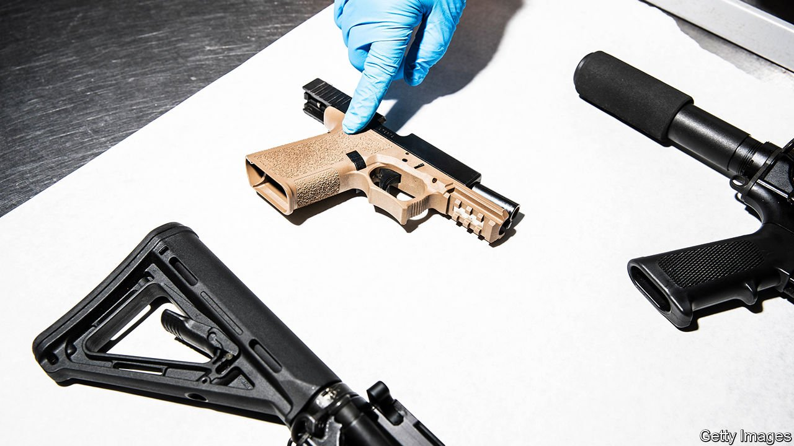

###### Phantom firearms

# Taking aim at ghost guns 

##### Can American politicians hit a spectral target? 

 

> Aug 7th 2021 

ACROSS AMERICA, police departments are seeing ghosts—the gun kind. “Ghost guns” are privately made firearms that do not have serial numbers and are therefore impossible to trace if they are used to commit a crime.

They are on the rise. Last year 8,712 such guns were recovered at potential crime scenes and reported to the Bureau of Alcohol, Tobacco, Firearms and Explosives (ATF), more than triple the number in 2017. In 2020 police in Baltimore recovered 126 ghost guns, 15 of which were directly linked to shootings. Nearly a quarter of ghost guns seized by Baltimore’s Police Department were from people too young to buy a firearm legally.


Technology is partly to blame. The internet has enabled people to buy kits or component parts and assemble them into guns without serial numbers. The well-resourced can also produce them with 3D printers. Websites that sell “80%” receivers, which are almost-finished firearms that require time and tools to put together, have thrived. Typically all you need is metal files, sandpaper, WD-40, a hammer, screwdriver, bench vice and power drill to assemble the firearm’s parts: kits arrive with instructions and links to video tutorials. “This makes starting your own personal gun factory a breeze,” boasts one firm, 80 Percent Arms, in its online listing for an AR-15 home-assembly kit.

Such sellers are exploiting loopholes to their advantage. Because they are peddling unfinished kits and not completed guns, these companies have technically not been required to mark a serial number on the “frame” or “receiver”, which contains all the gun’s operating parts. Nor have they been obliged to conduct a background check on buyers, as licensed gun-dealers must do. This means that people who might be barred from buying a gun, such as convicted felons, the mentally ill or the under-age, are able to do so with relative ease.

Police departments and politicians are worried. In 2019 the House Committee on Homeland Security argued in a report that “terrorists and other bad actors may seek to exploit the availability of these weapons for dangerous ends”, and called ghost guns a “homeland-security threat”. They have already proved to be a threat to public safety. Perpetrators of several mass shootings, including one two years ago in Dayton, Ohio, that killed nine people, have used home-assembled firearms.

Various levels of government are starting to crack down, including state legislatures and counties. So far this year ten states have introduced bills to regulate unserialised weapons, and more are expected this autumn. Governors in several states, including Nevada and Hawaii, have signed laws that take aim at ghost guns. “There’s huge interest in this” among state legislators, says Kris Brown of Brady, a gun-control organisation. “In the hyper-partisan world in which we live, these kinds of bills have a reasonable shot of getting through even conservative legislatures,” she adds.

Facing Republican resistance to new gun laws, the Biden administration has not pushed for a solution through Congress; instead, it is aiming to do so through an executive order, requiring the Department of Justice to come up with new ways to curb ghost guns. The department has proposed requiring all vendors of kits containing the parts to assemble a firearm to run background checks; requiring manufacturers to include a serial number on firearm “frames” sold in kits; and obliging federally licensed dealers to add a serial number to any non-serialised gun they sell. The gun lobby has been more muted in its criticism than usual; comments on the proposed rules are due next month.

Will the crackdown work? Requiring serialisation and background checks gives law-enforcement officers more firepower to prosecute people who are up to no good. However, America has so many guns already in circulation that malefactors who want a weapon will easily find a way to get one. State laws can only do so much, because firearms can flow in from neighbouring states with laxer rules. A federal law would be much better.

Haunted hunting

One federally licensed firearms dealer predicts that some gun-parts sellers will try to find loopholes. Already there has been a run on AR-15 gun kits, which are sold out on many websites. Whenever people think a particular type of firearm is going to be targeted by new regulation, it boosts sales. For example, the sale of AR-15s spiked after the Sandy Hook massacre in 2012, when people thought Democrats might ban assault weapons. (They tried to, but Republicans blocked them.)

The most effective way to combat gun violence is through universal background checks for gun sales, says Adam Winkler, author of the book “Gunfight”. But as technology makes it cheaper and easier to create your own gun, the background-check process could lose some of its efficacy, he says. Catching people who are illicitly selling and manufacturing guns would also require significantly more resources. Yet the ATF has been starved of funding and manpower. It has had a permanent, Senate-confirmed director in just two of the past 15 years, because of effective opposition by the pro-gun lobby. Despite politicians’ best efforts, ghost guns may haunt America for many years. ■

For more coverage of Joe Biden’s presidency, visit our dedicated 

